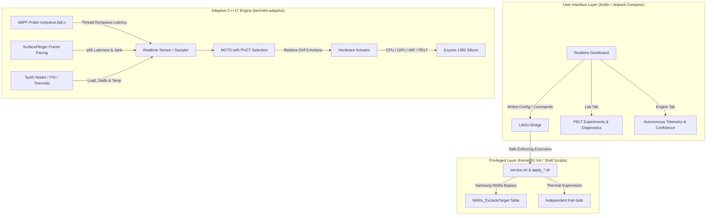

# PUCTuner 🚀
### Autonomous MCTS-PUCT Hardware & DVFS Governor for Android

[](https://android.com)
[-blue.svg)](https://semiconductor.samsung.com/processor/mobile-processor/exynos-1380/)
[-orange.svg)](https://developer.arm.com/Processors/Mali-G68)
[](https://github.com/tiann/KernelSU)
[-purple.svg)](#-decision-algorithm-mcts--puct)
[](LICENSE)

> **A closed-loop experimental Android hardware controller using MCTS with PUCT selection, frame/PSI telemetry, and learned transition dynamics.**  
> Reference production platform and calibration: **Samsung Galaxy M54 5G (SM-M546B / Exynos 1380)**.

📖 **Core Documentation:** [Technical Deep-Dive & Architecture](docs/HOW_IT_WORKS.md) · [Benchmarks & Empirical Validation](docs/BENCHMARKS.md) · [eBPF Telemetry](docs/EBPF.md) · [Building Guide](BUILDING.md)

---

## ⚡ Paradigm Shift: No More Placebos

The Android customization community has historically been plagued by "snake-oil modules" promising 120 FPS by injecting dozens of dead lines into `build.prop`, tweaking cache parameters that were deprecated years ago, or pinning maximum frequencies that trigger aggressive thermal throttling within two minutes of gameplay.

**PUCTuner** was built on the exact opposite foundation: **rigorous computer science, direct empirical hardware measurement, and closed-loop adaptive control**.

| What typical "tuners" do | What PUCTuner does |
|---|---|
| Injects dead `ro.hwui.*_cache` props that modern Android never reads | Directly reads and writes proprietary sysfs nodes (`/sys/kernel/gpu/`, cpufreq, devfreq MIF) |
| Pins CPU/GPU to maximum (`min == max`), accelerating thermal throttling | MCTS searches for the minimum effort required to sustain 60/120 Hz without thermal waste |
| Requires users to manually switch profiles between gaming and battery saving | The adaptive controller reacts to frame evidence and PSI stalls while enabled; `profile` remains a separate static fallback/price tier |
| Blind scripts that assume success if the shell returns 0 | Read-back verification: if the kernel driver caps or rejects a value, the UI flags it immediately |

---

## 🧠 System Architecture

The project is split into three decoupled layers operating under strict security boundaries:



1. **`app/`**: Kotlin and Jetpack Compose application optimized with R8 (`com.orkgabb.m54tuner`). Polls live device state every three seconds while idle and exposes the module's verification report.
2. **`module/`**: Native module for KernelSU / Magisk executing in `init` context under strict SELinux **Enforcing** mode (no need for permissive mode or security compromises).
3. **`module/bin/m54-adaptive`**: Standalone ARM64 daemon written in modern C++17, compiled with NDK Clang r28. Self-contained native binary with no interpreter/network/ML runtime dependencies; it polls sensors at 1 Hz and closes a planning window on frame evidence (4.5–12 s, nominally ~6 s). Verify its resident size live (e.g. `ps -o RSS -C m54-adaptive`) rather than trusting a fixed megabyte number here.

---

## 🤖 Decision Algorithm: MCTS + PUCT

Inspired by **DeepMind** research (AlphaGo, AlphaZero) and Christopher D. Rosin's PUCT algorithm (2011), PUCTuner does not rely on hardcoded heuristics: it executes **Monte Carlo Tree Search with PUCT (*Predictor Upper Confidence bounds applied to Trees*) selection**:

$$\text{PUCT}(s, a) = Q(s, a) + c_{\text{puct}} \cdot P(s, a) \cdot \frac{\sqrt{\sum_b N(s, b)}}{1 + N(s, a)}$$

* **$Q(s, a)$ (Exploitation):** Expected cumulative return of the frequency combination.
* **$P(s, a)$ (Prior):** Learned prior probability distribution specific to the active application context.
* **$N(s, a)$ (Visits):** Number of times this branch was simulated in the tree.
* **Dirichlet Noise:** Injected strictly at the root (`.75 * prior + .25 * dirichlet`) to prevent premature convergence into local minima.

### Exogenous Multi-Channel Reward Function
The reward $r(s, a)$ is directly grounded in device physics:

$$r(s, a) = 1 - 2 \cdot \left( \mathbf{w} \cdot \mathbf{c}(s, a) \right)$$

Where the cost vector $\mathbf{c}(s, a)$ comprises 9 real-time measured metrics:
* **`LateCost`**: Frame presentation delay ($p95$) against the display refresh budget (16.6 ms for 60 Hz / 8.3 ms for 120 Hz).
* **`JankCost`**: Frame interval variance and noticeable hitching between consecutive frames.
* **`EnergyCost`**: Power dissipation proxy in Watts based on active frequency states.
* **`PressureCost`**: Kernel Pressure Stall Information (*PSI*) across CPU, memory, and I/O.
* **`HeatCost` & `RisingCost`**: Thermal readings of Cortex-A78/A55 cores and Mali GPU, plus heating rate derivative ($dT/dt$).
* **`BreachCost`**: Severe penalty when approaching hardware safety thresholds.
* **`EffortCost`**: Minimum intervention cost, preventing destructive *DVFS thrashing*.

### Evidence Aging and Surprise-Driven Re-exploration
In mobile workloads, game scenes and thermal environments shift dynamically:
1. **Two half-lives, not one:** prediction trust decays as $N \cdot 2^{-\Delta \text{age} / 1024}$,
   while the novelty re-ask clock decays as $2^{-\Delta \text{age} / 64}$ (asymmetric: releasing
   effort is re-tried more freely than spending it). See `docs/HOW_IT_WORKS.md` §7.
2. **Surprise Detection (`surprises`):** If real measurements deviate from predicted values by more than 4 standard deviations ($|\text{real} - \text{predicted}| > 4\sigma$), cell authority in that context is reset to 1 visit, triggering immediate active re-exploration.

---

## 🔍 Hardware Deep-Dive: Samsung Exynos 1380 (`s5e8835`)

Unlike generic Snapdragon platforms, the Exynos architecture features specific low-level kernel characteristics:

* **Heterogeneous CPU (4× Cortex-A78 + 4× Cortex-A55):**
  * `policy0` (A55): 533 MHz to 2002 MHz.
  * `policy4` (A78): 533 MHz to 2400 MHz.
  * The engine tracks load per **individual thread of the foreground process**, rather than global average CPU utilization (a heavy game saturating a single render thread at 100% registers only 12.5% across 8 cores; PUCTuner detects this bottleneck immediately).
* **Mali-G68 MP5 GPU (Valhall 2nd Gen / r1p1, Driver DDK r38p1-01):**
  * Governed exclusively through Samsung sysfs nodes in `/sys/kernel/gpu/` (not present in standard devfreq).
  * Operating frequencies: 221 MHz to 949 MHz.
  * `polling_speed` 15 ms and `js_scheduling_period` 50 ms are the **game-preset** values
    (`apply_profile.sh`); other presets use slower polling. They do not by themselves fix frame
    drops in any specific title — measure per game instead of trusting the preset.
* **Memory Bus (MIF):**
  * Kernel enforces a physical QoS ceiling at **2093 MHz**. Attempting to write higher clocks is discarded by the hardware driver. PUCTuner respects this ceiling and manipulates the **floor**, ensuring necessary DRAM bandwidth without false claims.
* **Samsung MARs / Chimera Killer Exemption (opt-in, off by default):**
  * When `samsung_protect=1`, PUCTuner adds the listed packages to the official system `MARs_ExcludeTarget` table — the same list Device Care writes — without modifying framework binaries. "Bypass" would overstate it: it is a per-app exemption using the system's own mechanism. Inserts and removals are queried back; provider errors are failures rather than evidence of absence.
* **Uninstall:** kernel, sysfs and property changes vanish on the next reboot, but MARs exemptions, SPCM, Samsung settings and GOS do not. Magisk and KernelSU run `uninstall.sh` before the Android framework is up, when those settings cannot be written, so the restore waits for boot to complete, retries, and deletes `/data/adb/m54tuner` only after every value reads back as it was. If it never succeeds, the directory is kept; run `sh /data/adb/m54tuner/uninstall/uninstall_finish.sh` to retry.

---

## 🔬 Debunking Common Myths & Legacy Tweaks

Modding communities often recommend legacy tweaks (e.g. from *VideoPlayback_Vulkan* modules). Here is why PUCTuner rejects them:

1. **Non-Existent SurfaceFlinger Flags:**  
   Setting `debug.renderengine.backend=skiaglvk` triggers an immediate error in modern Samsung SurfaceFlinger (*"Non-threaded RenderEngine not supported"*). PUCTuner uses the real multithreaded backend: `skiavkthreaded`.
2. **Placebo HWUI Cache Properties:**  
   `ro.hwui.texture_cache_size`, `ro.hwui.layer_cache_size`, etc., were **removed from AOSP years ago**. Binary inspection of `libhwui.so` confirms modern Android does not parse them.
3. **The SBWC Fallacy:**  
   Disabling SBWC (`vendor.debug.c2.sbwc.enable=false`) turns off Samsung's lossless bandwidth compression, causing media playback to consume up to **40% more MIF memory bus bandwidth**, accelerating heat buildup and battery drain. PUCTuner keeps SBWC active.
4. **Vulkan on Mali-G68:**  
   The Mali-G68 is a 2nd Gen Valhall architecture (identical microarchitecture lineage to the G78) with full **Vulkan 1.3** certification. In the **Render** tab, users can safely toggle and verify between SkiaGL (OpenGL ES) and SkiaVK (Vulkan).

---

## 🛠️ Building and Installation

### Prerequisites
* Android Studio (Ladybug / Meerkat or newer) with JDK 17.
* Android NDK (r28 or newer).
* Linux / WSL2 (Ubuntu 22.04+) with `g++`, `clang`, and BPF cross-compilation toolchains.
* Samsung Galaxy M54 5G rooted with KernelSU Next or Magisk.

### 1. Build Native ARM64 Engine & Run Verification Tests
```bash
# Runs unit tests (with ASan/UBSan), closed-loop simulation, and cross-compiles ARM64 binary
bash tools/build_engine.sh
```

### 2. Build Android App (Optimized Release with R8)
```bash
# Compiles optimized release APK
bash tools/build_app.sh
```

### 3. Package KernelSU/Magisk Module
```bash
python tools/package.py
```

### 4. Direct Installation via ADB
```bash
# Install module live (no reboot required)
adb push m54tuner-module.zip /data/local/tmp/
adb push tools/install_live.sh /data/local/tmp/
adb shell "su -c 'sh /data/local/tmp/install_live.sh'"

# Install Android application
adb install -r -d m54tuner-release.apk
```

---

## 📊 Real-Time Telemetry & Transparency

PUCTuner provides completely open, inspection-friendly telemetry via ADB shell:

```bash
# Realtime autonomous engine state
su -c 'cat /data/adb/m54tuner/adaptive_status'

# Transition log and reward history
su -c 'tail -n 20 /data/adb/m54tuner/adaptive_history.csv'

# Hardware node read-back verification
su -c 'cat /data/adb/m54tuner/result'
```

---

## ⚖️ License

This project is licensed under the **GNU General Public License v3 (GPLv3)**. See [LICENSE](LICENSE) for details.
