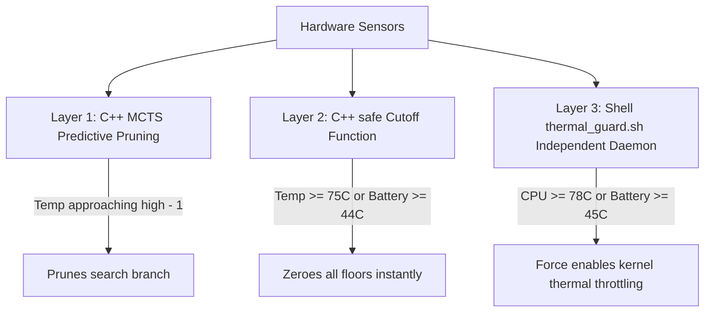

# PUCTuner — Technical Architecture & Forensic Deep-Dive

This document provides an exhaustive, code-referenced explanation of PUCTuner's internal algorithms, mathematical models, kernel interactions, and safety guarantees.

---

## 1. Daemon Architecture & The 6-Second Rolling Horizon

### Where is it implemented?
* Header: [`module/engine/core.hpp`](../module/engine/core.hpp)
* Core Logic: [`module/engine/core.cpp`](../module/engine/core.cpp)
* Main Loop: [`module/engine/main.cpp`](../module/engine/main.cpp)
* Hardware Bridge: [`module/engine/platform.hpp`](../module/engine/platform.hpp), [`module/engine/platform.cpp`](../module/engine/platform.cpp)

### How does the control loop work?
The standalone ARM64 daemon (`bin/m54-adaptive`) runs every 6 seconds without external runtimes (no Python, no TensorFlow Lite, no network). Each cycle executes a discrete 6-stage pipeline:

```text
[1. Sensor Sampling] ──▶ [2. Model Observation] ──▶ [3. Critic TD-Update]
         │                                                    │
         ▼                                                    ▼
[6. Sysfs Actuation] ◀── [5. Acceptance Gate]   ◀── [4. MCTS PUCT Search]
```

1. **`Sampler::read()`**: Collects SurfaceFlinger presentation timestamps, eBPF scheduler runqueue delays, sysfs load/thermal states, and Linux kernel PSI (Pressure Stall Information).
2. **`Model::observe()`**: Computes the error between predicted metrics and empirical measurements from the previous window, updating residual variance.
3. **`Critic::learn()`**: Calculates Temporal-Difference (TD) error across all 9 cost dimensions simultaneously, adjusting linear value network weights bounded by `MaxStep = 0.04`.
4. **`Planner::search()`**: Executes Monte Carlo Tree Search with PUCT selection and truncated rollout bootstrapped by the Critic.
5. **`accept()`**: Verifies that the proposed DVFS adjustment clears an asymmetric profit toll, discarding micro-oscillations.
6. **`Actuator::apply()`**: Atomically logs the target state to `adaptive_journal` and commits frequency floors via sysfs with immediate read-back verification.

---

## 2. Invariant Unit Testing under ASan/UBSan

### Where is it implemented?
* Test Suite: [`tests/engine_test.cpp`](../tests/engine_test.cpp)
* Build Script: [`tools/build_engine.sh`](../tools/build_engine.sh)

### What does it actually test?
`engine_test.cpp` contains 665 lines of deterministic assertions compiled with `-fsanitize=address,undefined`:

* **Fail-Safe Invariants ([`engine_test.cpp:L30-L38`](../tests/engine_test.cpp#L30-L38)):** Asserts that `safe()` unconditionally resets all floors to zero if SoC temperature >= 80°C, battery temperature >= 44°C, battery level < 10%, or sensor validation flags fail.
* **Thermal-Energy Allowance (`Budget`):** Verifies that continuous high effort at 74°C drains allowance headroom to < 0.2 (collapsing permissible floors to Level 1), while effort on a cold device (40°C) incurs zero allowance penalty ([`engine_test.cpp:L40-L58`](../tests/engine_test.cpp#L40-L58)).
* **Critic Gradient Clamping:** Ensures no single transition moves any feature weight by more than 0.04, guaranteeing numerical stability.
* **Serialization & State Migration:** Verifies bidirectional serialization (`M54_BRAIN_4`) and backward compatibility through `rehome` mappings.

---

## 3. Closed-Loop Simulation with Unannounced Workload Shifts

### Where is it implemented?
* Simulation Engine: [`tests/engine_sim.cpp`](../tests/engine_sim.cpp)

### What is the purpose of the simulation?
As stated directly in the code comments:
> *"The synthetic device is deliberately simple, and passing here is NOT evidence of a gain on the real M54: it only shows the loop converges toward the objective it was given, refuses to spend where nothing is bought, and respects its thermal limit under a hostile heat curve."*

### Simulation Benchmark Protocol (Averaged over 7 Random Seeds)
The test subjects the controller to three distinct 300-window phases with unannounced changes in device physics:
1. **Responsive Workload:** Hardware floors actively reduce p95 frame delay. The controller identifies the optimal operating point (`gpu=1.78`, `reward=+0.698`).
2. **Flat / Unresponsive Workload:** Increasing frequency floors produces zero reduction in frame delay (e.g. bottlenecked on I/O or game engine limits). The controller detects zero return, refusing to waste energy: **effort drops by 91% down to `0.17`**.
3. **Hostile Thermal Curve:** Environmental heat increases sharply. The controller automatically throttles effort to stay strictly below the 75°C ceiling with **zero safety breaches**.

---

## 4 & 5. PUCT Decision Algorithm, Q, P, N & Dirichlet Noise

### Where is it implemented?
* Search Engine: [`module/engine/core.cpp:L880-L955`](../module/engine/core.cpp#L880-L955)

### Mathematical Formulation
During the selection phase, the tree descends by maximizing the PUCT score:

$$\text{PUCT}(s, a) = Q(s, a) + c_{\text{puct}} \cdot P(s, a) \cdot \frac{\sqrt{\sum_b N(s, b)}}{1 + N(s, a)}$$

In C++:
```cpp
const double q = n.visits ? n.sum / n.visits / ValueLimit : 0;
const double score = q + 1.25 * n.prior * parentVisits / (1. + n.visits);
```

* **Q(s, a):** Normalized mean expected value accumulated across simulations.
* **P(s, a):** Softmax prior distribution learned by `Prior::distribution()` for the active context.
* **N(s, a):** Visit counter of the candidate action branch.
* **Root Dirichlet Noise ([`core.cpp:L868-L875`](../module/engine/core.cpp#L868-L875)):**
  ```cpp
  std::gamma_distribution<double> gamma(.6, 1);
  for (auto& x : noise) { x = gamma(rng); total += x; }
  root.pendingPrior[i] = .75 * root.pendingPrior[i] + .25 * noise[i] / total;
  ```
  Exploration noise is injected **strictly at the root** of the search tree where real decisions affect hardware, preventing random jitter deep inside simulated rollouts.
* **Predictive Thermal Pruning ([`core.cpp:L907-L910`](../module/engine/core.cpp#L907-L910)):** If the internal transition model predicts that expanding a node would push temperature within 1°C of the thermal ceiling, that branch is pruned immediately without wasting search iterations.
* **Critic-Bootstrapped Tail:** Rollouts simulate up to `horizon = 4` steps under prior distributions, bootstrapping the remainder using the Critic value:
  ```cpp
  value += discount * brain.critic.value(state, limits, action);
  ```

---

## 6. Exogenous Multi-Channel Reward Function & Weights

### Where is it implemented?
* Weights & Normalization: [`module/engine/core.cpp:L127-L167`](../module/engine/core.cpp#L127-L167)

### Reward Formulation
Reward is linear in independent physical terms, scaled to [-1, 1]:

$$r(s, a) = \text{clip}\left(1 - 2 \sum_{i=0}^{8} w_i \cdot c_i, -1, 1\right)$$

### Objective Weight Profiles (w)
```cpp
//  Late   Jank   Energy Pressure Heat  Rising Battery Breach Effort
{{ .48,   .28,   .08,   .08,     .22,  .12,   .30,    1.0,   .005 }}, // Game
{{ .32,   .23,   .25,   .10,     .22,  .12,   .30,    1.0,   .025 }}, // Balanced
{{ .22,   .20,   .43,   .08,     .22,  .12,   .30,    1.0,   .040 }}, // Powersave
```
* **Game:** Heavily penalizes frame delay (0.48) and jank (0.28); minimal intervention toll (0.005).
* **Powersave:** Energy (0.43) and intervention toll (0.040) are prioritized; effort costs 8x more than in Game.
* **Universal Safety Limits:** Safety breaches (`BreachCost = 1.0`), battery limits (0.30), and thermal constraints (0.22) share identical weights across all profiles.

### Metric Normalization
* **`LateCost`:** Primary service deficit from frame pacing (or stall if headless).
* **`JankCost`:** Frame interval variance clip in [0, 1].
* **`EnergyCost`:** Operating power proxy clip in [0, 1.5].
* **`PressureCost`:** Kernel PSI formula: clip(CPU_psi + 1.5 * Mem_psi + IO_psi, 0, 1).
* **`HeatCost`:** Normalized excess above operating band: clip((T - (T_high - 12)) / 12, 0, 2).
* **`EffortCost`:** Hardware floor step index divided by `MaxEffort` (16).

---

## 7. Transition Dynamics, Evidence Aging & Surprise Triggers

### Where is it implemented?
* Model & Evidence: [`module/engine/core.cpp:L410-L480`](../module/engine/core.cpp#L410-L480)

### Exponential Evidence Decay
Unlike static tuners that treat old observations as eternal truth, PUCTuner applies half-life aging:

$$N_{\text{fresh}} = N \cdot 2^{-\Delta \text{age} / 64}$$

When a hardware state remains unvisited for 64 samples, its visit authority drops by 50%, prompting MCTS to periodically re-verify alternative actions under exploration budgets.

### Surprise-Triggered Re-Exploration
If real measured frame latency deviates from the model's mean prediction by more than 4 residual standard deviations:

$$|\text{actual} - \text{predicted}| > \max(4.0, 4 \cdot \sqrt{\sigma^2 + 1.0})$$

The engine detects that workload conditions (e.g. entering a complex combat scene) have broken prior assumptions. It **resets the authority of all cells in that context to 1 visit**, immediately triggering active re-exploration.

---

## 8. Anti-Oscillation & DVFS Chattering Prevention

### Where is it implemented?
* Gate: [`module/engine/core.cpp:L504-L518`](../module/engine/core.cpp#L504-L518)

### The Acceptance Toll
High-frequency DVFS switching (*chattering*) degrades performance due to PLL lock latencies and PMIC voltage settling (~100–500 µs). PUCTuner suppresses chattering through three independent mechanisms:

1. **Rollout Transition Penalty:** Any simulated move that changes the hardware state pays an immediate cost penalty:
   ```cpp
   child.immediate = reward(...) - (choice.action != parentAction ? .015 : 0);
   ```
2. **Asymmetric Acceptance Toll (`accept()`):**
   ```cpp
   const double toll = costlier ? (c.tier == Tier::Game ? .008 : .015) : .004;
   if (advantage >= toll) return true;
   ```
   Increasing frequency floors requires proving a significant expected advantage over the current state (0.015). Conversely, releasing frequency floors requires only a small margin (0.004), ensuring the device returns to low-power baseline as soon as demand subsides.
3. **Exploration Cap:** Untried states with higher effort are limited to at most 3 exploratory attempts before requiring strict advantage proof.

---

## 9. Hardware Actuation & Crash-Resilient Journaling

### Where is it implemented?
* Actuator: [`module/engine/platform.cpp:L453-L560`](../module/engine/platform.cpp#L453-L560)

### Sysfs Nodes (Samsung Exynos 1380)
* **CPU:** `/sys/devices/system/cpu/cpufreq/policy*/scaling_min_freq`
* **GPU:** `/sys/kernel/gpu/gpu_min_clock` and `gpu_max_clock`
* **Memory Bus (MIF):** `/sys/class/devfreq/*mif*/min_freq`
* **Kernel Scheduler:** `/proc/sys/kernel/sched_pelt_multiplier`

### Safety Guarantees
* **Never Pin `min == max`:** The actuator caps floor adjustments at the second-highest frequency table step (`table[table.size() - 2]`), allowing kernel governors to scale up while preventing premature thermal throttling.
* **Write-Ahead Recovery Journal (`adaptive_journal`):** Before modifying any sysfs node, the original factory clock and the last targeted clock are written atomically to persistent storage. If `m54-adaptive` receives `SIGKILL`, the subsequent startup detects the journal and restores stock frequencies.
* **Read-Back Verification:** Every write is immediately read back from the kernel node. If the driver clamps or rejects the value, the write is aborted.

---

## 10. Multi-Tier Independent Thermal Fail-Safes

### Where is it implemented?
* Native Logic: [`module/engine/core.cpp:L223-L240`](../module/engine/core.cpp#L223-L240)
* Independent Daemon: [`module/scripts/thermal_guard.sh`](../module/scripts/thermal_guard.sh)

Thermal safety operates across completely isolated layers:



1. **Layer 1 (Search Pruning):** MCTS refuses to simulate branches that heat the device beyond safety boundaries.
2. **Layer 2 (Engine Cutoff):** If sensor readings reach 75°C SoC or 44°C battery, `safe()` drops all hardware floors to Level 0 immediately.
3. **Layer 3 (Out-of-Process Fail-Safe):** `thermal_guard.sh` runs as an independent root process with its own PID. Even if the C++ daemon crashes or hangs, the shell guard monitors all thermal zones every 2 seconds. If CPU/GPU reaches 78°C or battery reaches 45°C, it immediately forces `/sys/class/thermal/thermal_zone*/mode` back to `enabled`.
